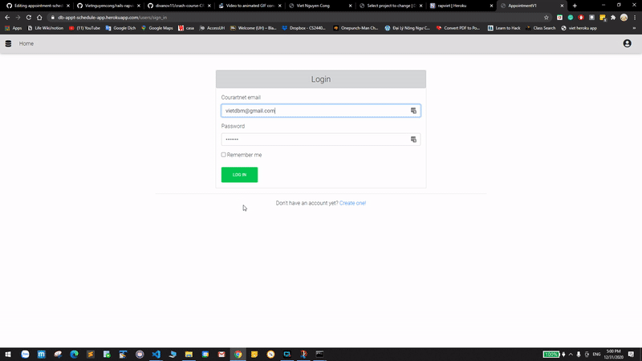

# Appointemnt Scheduling app 

This app was built for my need as I will need to schedule an appointment with somebody at some point. 

Framework: Ruby on Rails 6 

## Gem used: 
devise, faker, simple-calendar
## Technologies used:
* S3 bucket for storages
* mailgun for sending email 

## Features:
* Scheudling appointments

* Sending email using mailgun api

* Admin's dashboard

* Image uploading 

